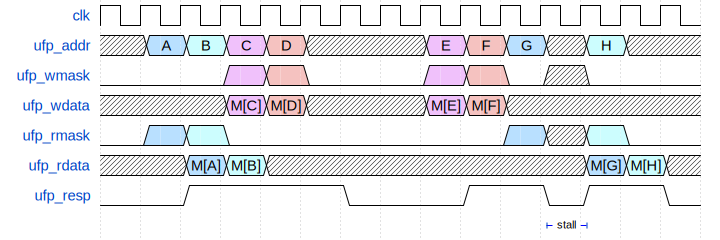

# Cache Competition

This **OPTIONAL** competition is purely for fun and bragging rights. Your performance in the competition will have no bearing on your grade for `mp_cache`. **You are only encouraged to partipate after you are confident that you have finished the main assignment.** Any students who wish to further their design experience by creating a more advanced cache may compete. 

The competition will run multiple memory transaction sequences with your cache, and will report the total time for all transactions for your design. The goal is to have the lowest total time possible.

## Rules


1. Submissions must be made on a `competition` branch. To create such a branch, after pulling the cache assignment from release, run
```
$ git checkout -b competition
```

2. You must indicate participation in the competition with the `competition` flag set to `true` in `configs/config.yaml`.

3. The cache must have the same module interface as the main assignment, as detailed in [README.md](./README.md).


4. You will be allowed to submit either a pipelined or non-pipelined cache. In order to indicate this to the autograder, you must set the `pp_cache` flag to `true` in `configs/config.yaml`.

5. The area limit is 100,000 μm^2. Any cache exceeding this area will be disqualified from the competition.

6. Any cache that is not functionally correct (read values are incorrect), or that times out (takes too long for any given transaction) will be disqualified from the competition.

## Pipelined Cache

You may notice that the behavior of the state machine cache implies that even for a sequence of memory transactions that are mainly hits, we can only achieve a throughput of 0.5 accesses per cycle. To improve this, we may *pipeline* the cache, similarly to how you pipelined a RISC-V cpu in `mp_pipeline`. In order to pipeline the cache, consider the following architecture.

<p align="center">  <p align="center">Pipelined cache</p> </p>

We may use a register to store the UFP transaction that can be used for hit detection and UFP responses, while allowing a new UFP transaction to initiate an SRAM operation in the same cycle. Of course, the pipeline will have to stall for any cache misses.

If you would like to submit a pipeline cache, set the `pp_cache` flag to `true` in `configs/config.yaml`. By setting this to true, the competition testbench will be allowed to submit a UFP transaction on on the same cycle that `ufp_resp == 1'b1`. If `pp_cache` is set to `false`, the competition testbench will not submit a new UFP transaction until at least the cycle after `ufp_resp == 1'b1`.

<p align="center">  <p align="center">Pipelined cache waveform</p> </p>

This is an example of a pipelined cache that achieves a throughput of (almost) 1 access per cycle. You should note, due to the non-write-through behavior of SRAM, any read immediately after a write will need to wait for the write to complete, meaning a bubble must be introduced.

## Advanced Features

Below are some advanced features you may consider adding to your cache design to improve performance.

### Prefetching

A prefetcher aims to predictively fill the cache with information that may be used in the near future. Usually, one will use the downtime of the cache to prefetch. A good prefetcher must be:
- Timely: lines are prefetched far enough in advance that they are available when the CPU requests them.
- Accurate: lines that will *actually* be used are prefetched, prefetching useless lines may pollute the cache and cause unnecessary evictions.

Common prefetchers include:
- Next-line prefetcher: After a miss to cacheline $N$, prefetch cacheline $N+1$.
- Stride prefetcher: After a miss to cacheline $N$, prefetch cacheline $N+S$ where $S$ is the stride of the last $k$ misses. You will need to observe miss addresses to determine the stride.


### Victim Cache

A victim cache is a small cache that sits between the main cache and the physical memory. It is used to store evicted cachelines from the main cache. If a cacheline is evicted from the main cache, it is first stored in the victim cache. If the cacheline is accessed again, it can be retrieved from the victim cache.

### Advanced Replacement Policies

For the mp, you will implement a tree-PLRU replacement policy, which is advantageous since it requires only $N-1$ bits per set of a set-associative cache with associativity $N$. Of course, a PLRU replacement policy doesn't evict the *truly* least recently used cache line during a replacement (proving this is a worthwhile exercise for the reader). A true LRU replacement policy requires using $N\log{(N)}$ bits of metadata, which costs more area. Other cache replacement polilcies, like not-most-recently-used (nMRU), Re-Reference Interval Prediction (RRIP), or even *random* eviction are other choices with tradeoffs regarding hardware complexity and optimality of eviction choices. You may consider implementing one of these replacement policies for your cache, but you may not see as big of an improvement in hit rate as changing cache size, associativity, or using a prefetcher or victim cache.

## Memory traces

The memory traces run will be a combination of semi-random accesses and traces of real programs (possibly including delays between memory accesses). Scores will be reported on a leaderboard for all memory traces run. 


